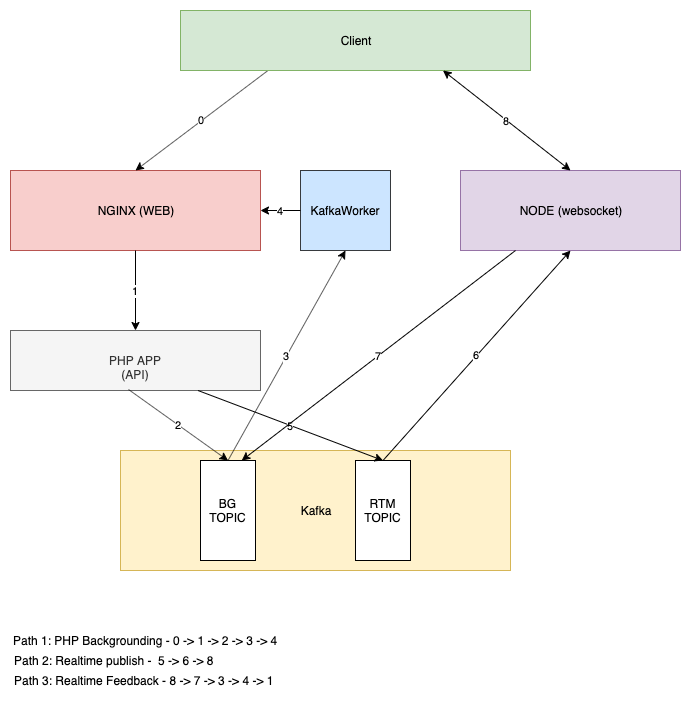

## Airsend Messaging flow

Events in Airsend will be published in foreground and in background.
Any subscriber can choose to receive events in foreground or in background
If the event is subscribed in foreground, _it will **block** the call until 
it is processed!_

#### Event BackgroundFlow

Airsend components has the ability to request processingevents in the background.   This involves Kafka to route messages to background. The 
general backgrounding flow in the above image is described below

1. A publisher raises an event to EventManager.Typically the event will be sent to foreground and background. However, this is detailing the background path
1. EventManager will send it to Background Dispatcher with the event
1. Background Dispatcher will produce this event to Kafka 
1. Kafka will publish it to PHP consumer application (which is a separate
application)
1. PHP Consumer will forward it to NGINX webserver using "internal" API path
1. Background Dispatcher in turn will publish the event to Event Manager in "foreground" mode
1. Event Manager now will publish it , which is finally received by the subscriber. in background context

## Usage

### Events
Events are objects containing event id and some optional payload to sent along with the event. 
* A publisher can publish an event object of baseclass ASEvent
* A subscriber can choose to receive the event in **foreground** or in **background** . There are static
helper methods provided by the event to choose the event type. 
        
        <eventclass>::backgroundEventName() // This is the background version of the event.
        <eventclasst>::foregroundEventName() // This is the foreground version of the event.
 

### Publish an event
The first step is to create the Event object and then use container to get access to the EventManager class and call publishEvent.
Here is an example that creates an event object (That has a User object as a payload) 

         $user = new User("testuser@test.com", "Test User $i");
         $event = new UserCreatedEvent($user);

         $this->container->get(EventManager::class)->publishEvent($event);

### Subscribe for an event
To subscribe for an event, there are two options.

#### Using EventSubscriberInterface (Preferred)
Using the EventSubscriberInterface interface. If you implement this, then 
getSubsribedEvents method should have all the events (foreground and background version) you are interested. This will
be subscribed on application start (*It also requires adding this component to EventCallbacks class*)

This shows a class registering its methods to be called for specific events

    public static function getSubscribedEvents()
    {
        return [
            UserLoggedInEvent::backgroundEventName() => 'onUserLoggedIn',
            UserCreatedEvent::backgroundEventName() => 'onUserCreated'
        ];
    }
  
#### Using addListener method 
Another method to subscribe for event is using addListener class of Event Manager. 
*The function should be a **callable** function*. Here is an example, but ideally the class should be coming
from container.
   
    $this->container->get(EventManager::class)->addListener(UserLoggedInEvent::inBackground(), [$this, 'myCallback']);
    
    
#### Kafka Queue Layout

Subsystem interaction using Kafka Queue

#### Client Connection Flow
This shows the interaction in establishing endpoint connections by a client app with Airsend

